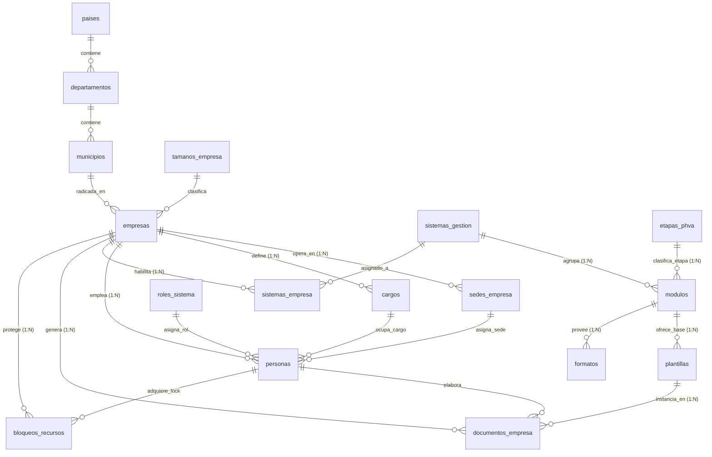

# 🛡️ Plataforma Multi-Tenant para Gestión de SST y PESV en PostgreSQL

Sistema de base de datos relacional y documental en **PostgreSQL** para la administración centralizada, trazable y aislada de los procesos de **Seguridad y Salud en el Trabajo (SG-SST)** y del **Plan Estratégico de Seguridad Vial (PESV)** bajo una arquitectura **Multi-Tenant**.

---

## 📋 Tabla de Contenido

1. [Introducción y Contexto](#-introducción-y-contexto)
2. [Arquitectura Multi-Tenant y Enfoque Híbrido](#-arquitectura-multi-tenant-y-enfoque-híbrido)
3. [El Ciclo PHVA en SST y PESV](#-el-ciclo-phva-en-sst-y-pesv)
4. [Diagrama Entidad-Relación (Mermaid)](#-diagrama-entidad-relación-mermaid)
5. [Estructura de Archivos SQL del Proyecto](#-estructura-de-archivos-sql-del-proyecto)
6. [Guía de Implementación Paso a Paso](#-guía-de-implementación-paso-a-paso)
7. [Control de Concurrencia y Bloqueos de Recursos](#-control-de-concurrencia-y-bloqueos-de-recursos)
8. [Vistas Materializadas e Indicadores](#-vistas-materializadas-e-indicadores)
9. [Matriz de Cumplimiento de Objetivos Académicos](#-matriz-de-cumplimiento-de-objetivos-académicos)

---

## 🎯 Introducción y Contexto

En Colombia y Latinoamérica, la administración de la **Seguridad y Salud en el Trabajo** (*Decreto 1072 de 2015* y *Resolución 0312 de 2019*) y del **Plan Estratégico de Seguridad Vial** (*Ley 1503 de 2011* y *Resolución 20223040040595 de 2022*) exige a las organizaciones documentar, auditar y evidenciar decenas de políticas, comités, inspecciones vehiculares y planes de acción de manera continua.

Tradicionalmente, las empresas gestionan esto en hojas de cálculo dispersas, ocasionando:
* Pérdida de trazabilidad y desactualización documental.
* Incumplimiento ante auditorías del Ministerio del Trabajo o ARL.
* Imposibilidad de medir el porcentaje real de avance por ciclo PHVA.

Este proyecto diseña e implementa una **solución de almacenamiento empresarial en PostgreSQL** que resuelve de forma centralizada esta problemática.

---

## 🏢 Arquitectura Multi-Tenant y Enfoque Híbrido

### 1. Aislamiento Lógico Multi-Tenant
En lugar de crear una base de datos independiente por cada empresa (lo cual incrementaría costos de infraestructura y mantenimiento), se adopta el patrón **Multi-Tenant con Aislamiento por Discriminador (`empresa_id`)**:
* Todas las empresas comparten el mismo esquema relacional.
* Cada tabla transaccional (`personas`, `cargos`, `sedes_empresa`, `documentos_empresa`, `bloqueos_recursos`) posee una clave foránea obligatoria `empresa_id`.
* La integridad y el aislamiento se blindan mediante **Triggers de seguridad** que impiden que un usuario de la Empresa A altere o consulte registros de la Empresa B.

### 2. Modelo Híbrido (`Relacional + JSONB`)
* **Núcleo Relacional Estricto:** Tablas normalizadas en Tercera Forma Normal (3FN) para garantizar integridad referencial en organizaciones, empleados, sedes y estados.
* **Flexibilidad Documental (`JSONB`):** 
  * En `plantillas`: almacena la estructura variable de secciones del documento (`estructura_secciones JSONB`).
  * En `registros_formatos`: almacena formularios dinámicos de inspecciones preoperacionales vehiculares y locativas (`datos_formulario JSONB`).
  * En `documentos_empresa`: preserva el cuerpo de los manuales y políticas de cada cliente sin alterar el esquema físico.

---

## 🔄 El Ciclo PHVA en SST y PESV

La estructura de datos organiza los procesos mediante las 4 fases de la mejora continua:

```
┌─────────────────┐       ┌─────────────────┐
│   1. PLANEAR    │ ───►  │    2. HACER     │
│  Políticas,     │       │ Capacitaciones, │
│  Objetivos,     │       │ Inspecciones,   │
│  Evaluación     │       │ Matriz Peligros │
└─────────────────┘       └─────────────────┘
         ▲                         │
         │                         ▼
┌─────────────────┐       ┌─────────────────┐
│    4. ACTUAR    │ ◄───  │  3. VERIFICAR   │
│ Planes Mejora,  │       │  Auditorías,    │
│ Acciones Corr.  │       │   Indicadores,  │
│ e Investigación │       │ Rev. Dirección  │
└─────────────────┘       └─────────────────┘
```

---

## 🏛️ Diagrama Entidad-Relación (Mermaid)



---

## 📂 Estructura de Archivos SQL del Proyecto

Todos los archivos han sido estructurados modularmente en la carpeta `proyecto/`:

| Orden | Archivo | Responsabilidad / Contenido |
| :---: | :--- | :--- |
| **01** | [`01_ddl_geografia_empresas.sql`](01_ddl_geografia_empresas.sql) | DDL de países, departamentos, municipios, tamaños de empresa, organizaciones (`empresas`) y sus sedes operativas. |
| **02** | [`02_ddl_personas_cargos.sql`](02_ddl_personas_cargos.sql) | DDL de cargos ocupacionales, roles de usuario, trabajadores (`personas`) y comités obligatorios (COPASST, Vial). |
| **03** | [`03_ddl_parametrizacion_sst_pesv.sql`](03_ddl_parametrizacion_sst_pesv.sql) | DDL de sistemas de gestión (SST/PESV), etapas PHVA (P, H, V, A), módulos funcionales y habilitación por tenant. |
| **04** | [`04_ddl_plantillas_formatos_evaluaciones.sql`](04_ddl_plantillas_formatos_evaluaciones.sql) | DDL de plantillas documentales, formatos operativos (preoperacionales) e instrumentos de evaluación (Res. 0312). |
| **05** | [`05_ddl_gestion_documental_bloqueos.sql`](05_ddl_gestion_documental_bloqueos.sql) | DDL de documentos por tenant, diligenciamiento de formatos, autoevaluaciones y tabla de concurrencia (`bloqueos_recursos`). |
| **06** | [`06_poblacion_semilla.sql`](06_poblacion_semilla.sql) | Datos semilla iniciales (geografía de Colombia, etapas PHVA, módulos estándar y 2 empresas de ejemplo para pruebas multi-tenant). |
| **07** | [`07_vistas_indicadores_phva.sql`](07_vistas_indicadores_phva.sql) | Vistas especializadas y Vista Materializada (`mv_indicadores_cumplimiento_phva`) con procedimiento de actualización automática. |
| **08** | [`08_funciones_procedimientos.sql`](08_funciones_procedimientos.sql) | Funciones y procedimientos PL/pgSQL: Onboarding de empresa, adquisición/liberación de bloqueos y cálculo de evaluación. |
| **09** | [`09_triggers_auditoria_bloqueos.sql`](09_triggers_auditoria_bloqueos.sql) | Triggers de seguridad: aislamiento estricto multi-tenant y prevención de edición concurrente ante bloqueos activos. |
| **10** | [`10_consultas_reportes.sql`](10_consultas_reportes.sql) | Batería de consultas avanzadas: avance porcentual PHVA, documentos pendientes y estado de bloqueos. |

---

## 🚀 Guía de Implementación Paso a Paso

Para desplegar este proyecto en tu entorno de PostgreSQL local:

### 1. Crear una base de datos dedicada
Puedes crear la base de datos `sst_pesv_db` dentro de tu contenedor:
```bash
docker exec -it postgres_db psql -U bkseducate -d postgres -c "CREATE DATABASE sst_pesv_db OWNER bkseducate;"
```

### 2. Ejecutar los scripts en orden secuencial
Desde PowerShell en tu máquina local:
```powershell
# DDLs Estructurales
Get-Content ./proyecto/01_ddl_geografia_empresas.sql -Raw | docker exec -i postgres_db psql -U bkseducate -d sst_pesv_db
Get-Content ./proyecto/02_ddl_personas_cargos.sql -Raw | docker exec -i postgres_db psql -U bkseducate -d sst_pesv_db
Get-Content ./proyecto/03_ddl_parametrizacion_sst_pesv.sql -Raw | docker exec -i postgres_db psql -U bkseducate -d sst_pesv_db
Get-Content ./proyecto/04_ddl_plantillas_formatos_evaluaciones.sql -Raw | docker exec -i postgres_db psql -U bkseducate -d sst_pesv_db
Get-Content ./proyecto/05_ddl_gestion_documental_bloqueos.sql -Raw | docker exec -i postgres_db psql -U bkseducate -d sst_pesv_db

# Población de Datos Maestros
Get-Content ./proyecto/06_poblacion_semilla.sql -Raw | docker exec -i postgres_db psql -U bkseducate -d sst_pesv_db

# Vistas y Programación PL/pgSQL
Get-Content ./proyecto/07_vistas_indicadores_phva.sql -Raw | docker exec -i postgres_db psql -U bkseducate -d sst_pesv_db
Get-Content ./proyecto/08_funciones_procedimientos.sql -Raw | docker exec -i postgres_db psql -U bkseducate -d sst_pesv_db
Get-Content ./proyecto/09_triggers_auditoria_bloqueos.sql -Raw | docker exec -i postgres_db psql -U bkseducate -d sst_pesv_db
```

---

## 🔒 Control de Concurrencia y Bloqueos de Recursos

El sistema previene que dos usuarios editen el mismo documento en simultáneo usando un esquema de **Pessimistic Locking a Nivel de Aplicación**:

1. **Adquirir Bloqueo:** El usuario solicita editar un documento:
   ```sql
   CALL sp_adquirir_bloqueo_recurso(
       p_empresa_id := 1,
       p_tipo_recurso := 'DOCUMENTO',
       p_recurso_id := 10,
       p_persona_id := 2,
       p_duracion_minutos := 15
   );
   ```
2. **Protección por Trigger:** Si otro usuario intenta actualizar ese documento mientras el bloqueo esté activo (`expira_en > CURRENT_TIMESTAMP`), el trigger [`trg_verificar_bloqueo_edicion`](09_triggers_auditoria_bloqueos.sql) **dispara una excepción y aborta la transacción**.
3. **Liberación:** Al guardar o cerrar el editor:
   ```sql
   CALL sp_liberar_bloqueo_recurso('DOCUMENTO', 10, 2);
   ```

---

## 📊 Vistas Materializadas e Indicadores

Para tableros gerenciales de alto rendimiento, la vista materializada [`mv_indicadores_cumplimiento_phva`](07_vistas_indicadores_phva.sql) precalcula:
* Porcentaje de cumplimiento global por organización.
* Categorización semafórica: `CUMPLIMIENTO_ALTO` (>=85%), `CUMPLIMIENTO_MEDIO` (60-84%), `EN_RIESGO_CRITICO` (<60%).

Para actualizar los datos sin bloquear lecturas concurrentes:
```sql
CALL sp_refrescar_indicadores_phva();
```

---

## ✅ Matriz de Cumplimiento de Objetivos Académicos

| # | Objetivo Académico | Archivo / Componente donde se Aplica |
| :-: | :--- | :--- |
| **1-4** | Análisis, modelado multi-tenant y 3FN | [`01`](01_ddl_geografia_empresas.sql), [`02`](02_ddl_personas_cargos.sql), [`03`](03_ddl_parametrizacion_sst_pesv.sql) |
| **5, 13** | Implementación física, PKs, FKs, CHECK y NOT NULL | Todos los archivos DDL |
| **6-8** | Operaciones CRUD y consultas con JOINs complejos | [`06_poblacion_semilla.sql`](06_poblacion_semilla.sql), [`10_consultas_reportes.sql`](10_consultas_reportes.sql) |
| **9, 15** | Vistas estándar y Vistas Materializadas de PHVA | [`07_vistas_indicadores_phva.sql`](07_vistas_indicadores_phva.sql) |
| **10** | Funciones y Procedimientos en PL/pgSQL | [`08_funciones_procedimientos.sql`](08_funciones_procedimientos.sql) |
| **11** | Triggers de seguridad, multi-tenant y validación | [`09_triggers_auditoria_bloqueos.sql`](09_triggers_auditoria_bloqueos.sql) |
| **12** | Índices estratégicos (B-Tree, filtrados y compuestos) | Índices en `01`, `02`, `04`, `05` y `07` |
| **14** | Modelo PHVA en estructura de datos | [`03_ddl_parametrizacion_sst_pesv.sql`](03_ddl_parametrizacion_sst_pesv.sql), [`07_vistas_indicadores_phva.sql`](07_vistas_indicadores_phva.sql) |
| **16** | Mecanismos de concurrencia y bloqueos | [`05`](05_ddl_gestion_documental_bloqueos.sql), [`08`](08_funciones_procedimientos.sql), [`09`](09_triggers_auditoria_bloqueos.sql) |
| **17** | Documentación técnica exhaustiva | [`README.md`](README.md) |
