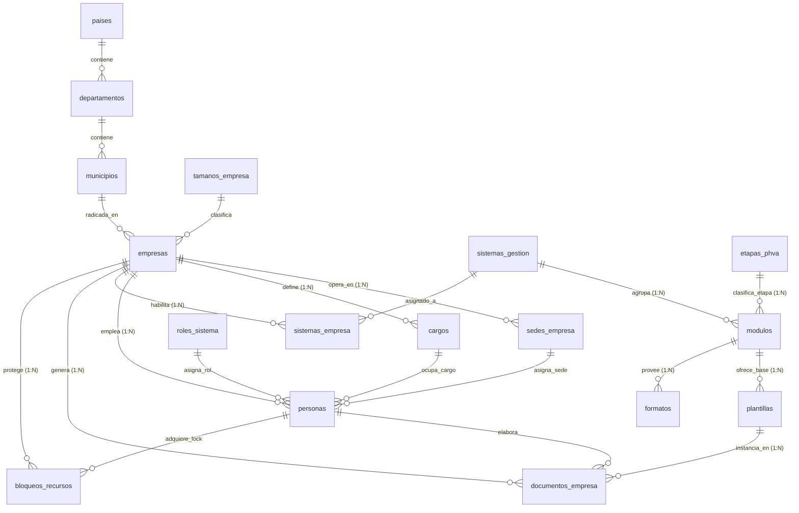

# 🛡️ Plataforma Multi-Tenant para Gestión de SST y PESV en PostgreSQL

Sistema de base de datos relacional y documental en **PostgreSQL** para la administración centralizada, trazable y aislada de los procesos de **Seguridad y Salud en el Trabajo (SG-SST)** y del **Plan Estratégico de Seguridad Vial (PESV)** bajo una arquitectura **Multi-Tenant**.

---

## 📋 Tabla de Contenido

1. [Introducción y Contexto](#-introducción-y-contexto)
2. [Arquitectura Multi-Tenant y Enfoque Híbrido](#-arquitectura-multi-tenant-y-enfoque-híbrido)
3. [El Ciclo PHVA en SST y PESV](#-el-ciclo-phva-en-sst-y-pesv)
4. [Diagrama Entidad-Relación (Mermaid)](#-diagrama-entidad-relación-mermaid)
5. [Estructura de Archivos SQL del Proyecto](#-estructura-de-archivos-sql-del-proyecto)
6. [Guía de Inicialización y Despliegue en macOS (Docker & pgAdmin)](#-guía-de-inicialización-y-despliegue-en-macos-docker--pgadmin)
7. [Control de Concurrencia y Bloqueos de Recursos](#-control-de-concurrencia-y-bloqueos-de-recursos)
8. [Vistas Materializadas e Indicadores](#-vistas-materializadas-e-indicadores)
9. [Matriz de Cumplimiento de Objetivos Académicos](#-matriz-de-cumplimiento-de-objetivos-académicos)

---

## 🎯 Introducción y Contexto

En Colombia y Latinoamérica, la administración de la **Seguridad y Salud en el Trabajo** (*Decreto 1072 de 2015* y *Resolución 0312 de 2019*) y del **Plan Estratégico de Seguridad Vial** (*Ley 1503 de 2011* y *Resolución 20223040040595 de 2022*) exige a las organizaciones documentar, auditar y evidenciar decenas de políticas, comités, inspecciones vehiculares y planes de acción de manera continua.

Tradicionalmente, las empresas gestionan esto en hojas de cálculo dispersas, ocasionando:
* Pérdida de trazabilidad y desactualización documental.
* Incumplimiento ante auditorías del Ministerio del Trabajo o ARL.
* Imposibilidad de medir el porcentaje real de avance por ciclo PHVA.

Este proyecto diseña e implementa una **solución de almacenamiento empresarial en PostgreSQL** que resuelve de forma centralizada esta problemática.

---

## 🏢 Arquitectura Multi-Tenant y Enfoque Híbrido

### 1. Aislamiento Lógico Multi-Tenant
En lugar de crear una base de datos independiente por cada empresa (lo cual incrementaría costos de infraestructura y mantenimiento), se adopta el patrón **Multi-Tenant con Aislamiento por Discriminador (`empresa_id`)**:
* Todas las empresas comparten el mismo esquema relacional.
* Cada tabla transaccional (`personas`, `cargos`, `sedes_empresa`, `documentos_empresa`, `bloqueos_recursos`) posee una clave foránea obligatoria `empresa_id`.
* La integridad y el aislamiento se blindan mediante **Triggers de seguridad** que impiden que un usuario de la Empresa A altere o consulte registros de la Empresa B.

### 2. Modelo Híbrido (`Relacional + JSONB`)
* **Núcleo Relacional Estricto:** Tablas normalizadas en Tercera Forma Normal (3FN) para garantizar integridad referencial en organizaciones, empleados, sedes y estados.
* **Flexibilidad Documental (`JSONB`):** 
  * En `plantillas`: almacena la estructura variable de secciones del documento (`estructura_secciones JSONB`).
  * En `registros_formatos`: almacena formularios dinámicos de inspecciones preoperacionales vehiculares y locativas (`datos_formulario JSONB`).
  * En `documentos_empresa`: preserva el cuerpo de los manuales y políticas de cada cliente sin alterar el esquema físico.

---

## 🔄 El Ciclo PHVA en SST y PESV

La estructura de datos organiza los procesos mediante las 4 fases de la mejora continua:

```
┌─────────────────┐       ┌─────────────────┐
│   1. PLANEAR    │ ───►  │    2. HACER     │
│  Políticas,     │       │ Capacitaciones, │
│  Objetivos,     │       │ Inspecciones,   │
│  Evaluación     │       │ Matriz Peligros │
└─────────────────┘       └─────────────────┘
         ▲                         │
         │                         ▼
┌─────────────────┐       ┌─────────────────┐
│    4. ACTUAR    │ ◄───  │  3. VERIFICAR   │
│ Planes Mejora,  │       │  Auditorías,    │
│ Acciones Corr.  │       │   Indicadores,  │
│ e Investigación │       │ Rev. Dirección  │
└─────────────────┘       └─────────────────┘
```

---

## 🏛️ Diagrama Entidad-Relación (Mermaid)



---

## 📂 Estructura de Archivos SQL del Proyecto

Todos los archivos han sido estructurados modularmente en la carpeta `proyecto/`:

| Orden | Archivo | Responsabilidad / Contenido |
| :---: | :--- | :--- |
| **01** | [`01_ddl_geografia_empresas.sql`](01_ddl_geografia_empresas.sql) | DDL de países, departamentos, municipios, tamaños de empresa, organizaciones (`empresas`) y sus sedes operativas. |
| **02** | [`02_ddl_personas_cargos.sql`](02_ddl_personas_cargos.sql) | DDL de cargos ocupacionales, roles de usuario, trabajadores (`personas`) y comités obligatorios (COPASST, Vial). |
| **03** | [`03_ddl_parametrizacion_sst_pesv.sql`](03_ddl_parametrizacion_sst_pesv.sql) | DDL de sistemas de gestión (SST/PESV), etapas PHVA (P, H, V, A), módulos funcionales y habilitación por tenant. |
| **04** | [`04_ddl_plantillas_formatos_evaluaciones.sql`](04_ddl_plantillas_formatos_evaluaciones.sql) | DDL de plantillas documentales, formatos operativos (preoperacionales) e instrumentos de evaluación (Res. 0312). |
| **05** | [`05_ddl_gestion_documental_bloqueos.sql`](05_ddl_gestion_documental_bloqueos.sql) | DDL de documentos por tenant, diligenciamiento de formatos, autoevaluaciones y tabla de concurrencia (`bloqueos_recursos`). |
| **06** | [`06_poblacion_semilla.sql`](06_poblacion_semilla.sql) | Datos semilla iniciales (geografía de Colombia, etapas PHVA, módulos estándar y 2 empresas de ejemplo para pruebas multi-tenant). |
| **07** | [`07_vistas_indicadores_phva.sql`](07_vistas_indicadores_phva.sql) | Vistas especializadas y Vista Materializada (`mv_indicadores_cumplimiento_phva`) con procedimiento de actualización automática. |
| **08** | [`08_funciones_procedimientos.sql`](08_funciones_procedimientos.sql) | Funciones y procedimientos PL/pgSQL: Onboarding de empresa, adquisición/liberación de bloqueos y cálculo de evaluación. |
| **09** | [`09_triggers_auditoria_bloqueos.sql`](09_triggers_auditoria_bloqueos.sql) | Triggers de seguridad: aislamiento estricto multi-tenant y prevención de edición concurrente ante bloqueos activos. |
| **10** | [`10_consultas_reportes.sql`](10_consultas_reportes.sql) | Batería de consultas avanzadas: avance porcentual PHVA, documentos pendientes y estado de bloqueos. |

---

## 🚀 Guía de Inicialización con Docker Compose en macOS (Flujo 100% Visual / Sin Terminal)

Este proyecto está diseñado para ser desplegado y operado **sin necesidad de trabajar en la consola de comandos**, utilizando **Docker Compose**, **Docker Desktop** y la interfaz gráfica web de **pgAdmin 4** en el navegador.

---

### 1. ¿Cómo funciona la arquitectura Docker sin terminal?

El archivo [`docker-compose.yml`](docker-compose.yml) y su configuración [`.env`](.env) automatizan todo el proceso:

```
┌─────────────────────────────────────────────────────────────────────────┐
│                           Tu macOS / Navegador                          │
│                                                                         │
│   🌐 Safari / Chrome (pgAdmin 4 Web) ──► http://localhost:8081         │
│   🐘 Cliente Mac opcional (TablePlus) ──► localhost:5433                 │
└────────────────────────────────────┬────────────────────────────────────┘
                                     │ Red Docker interna
                                     ▼
┌─────────────────────────────────────────────────────────────────────────┐
│                      Contenedores Docker Compose                        │
│                                                                         │
│  ┌───────────────────────┐             ┌─────────────────────────────┐  │
│  │      pgadmin_web      │             │         postgres_db         │  │
│  │  (Puerto int: 80)     │ ──────────► │  (PostgreSQL 16 en 5432)    │  │
│  │  Pre-registrado con   │             │  Auto-inicializado con:     │  │
│  │  ./servers.json       │             │  ./init/*.sql               │  │
│  └───────────────────────┘             └─────────────────────────────┘  │
└─────────────────────────────────────────────────────────────────────────┘
```

1. **Auto-inicialización:** Al levantar el contenedor por primera vez, PostgreSQL lee automáticamente la carpeta [`init/`](init/) (montada en `/docker-entrypoint-initdb.d/`) y ejecuta en orden todos los DDLs, población semilla, vistas, funciones y triggers. **No necesitas ejecutar ningún script manualmente en la terminal.**
2. **Auto-conexión en pgAdmin:** pgAdmin 4 se inicia con [`servers.json`](servers.json) preconfigurado, por lo que el servidor de base de datos ya aparece registrado en el panel de navegación.

---

### 2. Configuración del Archivo `.env`

Asegúrate de que en la raíz del proyecto exista el archivo [`.env`](.env) (o duplica [`.env.example`](.env.example)):

```env
POSTGRES_USER=bkseducate
POSTGRES_PASSWORD=bkseducate2026
POSTGRES_DB=bkddb
POSTGRES_PORT=5433

PGADMIN_DEFAULT_EMAIL=admin@example.com
PGADMIN_DEFAULT_PASSWORD=SuperBks123!
PGADMIN_PORT=8081
```

* **`POSTGRES_PORT=5433`:** Se usa el puerto 5433 en tu Mac para no colisionar con instalaciones nativas de PostgreSQL en el puerto 5432.
* **`PGADMIN_PORT=8081`:** Interfaz web lista en tu navegador en `http://localhost:8081`.

---

### 3. Encender el Entorno con 1 Clic (Sin Terminal)

Tienes dos métodos completamente visuales para encender todo:

* **Método 1: Con la extensión de Docker en VS Code / Cursor**
  1. Haz clic derecho sobre el archivo [`docker-compose.yml`](docker-compose.yml) en el explorador de archivos.
  2. Selecciona **Compose Up**.
  3. ¡Listo! Ambos contenedores (`postgres_db` y `pgadmin_web`) se levantarán automáticamente.

* **Método 2: Con Docker Desktop para Mac**
  1. Abre la aplicación **Docker Desktop** en tu Mac.
  2. En la sección **Containers**, localiza el grupo del proyecto y haz clic en el botón **Start / Play** (▶️).

*(Si en algún momento prefieres usar terminal rápida, el comando equivalente es simplemente: `docker compose up -d`).*

---

### 4. Trabajar en el Navegador con pgAdmin 4 (`http://localhost:8081`)

Una vez encendidos los contenedores, todo tu trabajo se realiza en el navegador web:

#### A. Iniciar Sesión
1. Abre **Safari** o **Google Chrome** y ve a: **`http://localhost:8081`**
2. Ingresa con las credenciales maestras:
   * **Email:** `admin@example.com`
   * **Contraseña:** `SuperBks123!`

#### B. Conectar a la Base de Datos
1. En el panel izquierdo, despliega la carpeta **Servers**.
2. Verás el servidor preconfigurado: **`Postgres Docker SST (bkddb)`**.
   *(Si requieres registrarlo manualmente: Clic derecho en Servers ➔ Register ➔ Server... ➔ Host: `postgres_db`, Port: `5432`, Maintenance DB: `bkddb`, User: `bkseducate`, Password: `bkseducate2026`).*
3. Haz doble clic sobre el servidor e introduce la contraseña: `bkseducate2026`.
4. Marca la casilla **Save Password** para no tener que volver a escribirla.

#### C. Verificar la Auto-Inicialización
Despliega: `Servers` ➔ `Postgres Docker SST` ➔ `Databases` ➔ `bkddb` ➔ `Schemas` ➔ `public` ➔ `Tables`.  
Verás **todas las tablas ya creadas y pobladas con datos**:
* `empresas`, `personas`, `cargos`, `sedes_empresa`
* `sistemas_gestion`, `modulos`, `etapas_phva`
* `plantillas`, `formatos`, `documentos_empresa`, `bloqueos_recursos`

---

### 5. Resolver y Probar Consultas desde el Query Tool (Visual)

Para ejecutar las consultas del examen o probar reportes:

1. En el panel izquierdo de pgAdmin, haz clic derecho sobre **`bkddb`** ➔ selecciona **Query Tool**.
2. En la barra superior del editor SQL:
   * Puedes abrir el archivo [`10_consultas_reportes.sql`](10_consultas_reportes.sql) haciendo clic en el icono de **Abrir Archivo (Carpeta)**.
   * O puedes copiar cualquier consulta de [`consultas.md`](consultas.md) y pegarla en el editor.
3. Selecciona la consulta que deseas evaluar con el cursor y presiona el botón **Execute (▶️)** o la tecla **`F5`** (en teclados Mac: **`Fn + F5`**).
4. Los resultados aparecerán inmediatamente en la pestaña inferior **Data Output**.

---

### 6. ¿Prefieres usar una App Nativa de Mac? (TablePlus / DBeaver)
Si prefieres un cliente nativo en macOS como **TablePlus** o **DBeaver**:
* **Host:** `localhost` o `127.0.0.1`
* **Port:** `5433` *(el puerto externo de tu Mac configurado en `.env`)*
* **Database:** `bkddb`
* **User:** `bkseducate`
* **Password:** `bkseducate2026`

---

### 7. Detener o Reiniciar desde Docker Desktop
Cuando termines tu jornada de trabajo:
* En la aplicación **Docker Desktop**, busca el grupo de contenedores del proyecto y presiona el botón **Stop (⏹️)**.
* Cuando vuelvas a trabajar, solo presiona **Start (▶️)**; tus datos permanecerán intactos gracias a los volúmenes persistentes.

---

## 🔒 Control de Concurrencia y Bloqueos de Recursos

El sistema previene que dos usuarios editen el mismo documento en simultáneo usando un esquema de **Pessimistic Locking a Nivel de Aplicación**:

1. **Adquirir Bloqueo:** El usuario solicita editar un documento:
   ```sql
   CALL sp_adquirir_bloqueo_recurso(
       p_empresa_id := 1,
       p_tipo_recurso := 'DOCUMENTO',
       p_recurso_id := 10,
       p_persona_id := 2,
       p_duracion_minutos := 15
   );
   ```
2. **Protección por Trigger:** Si otro usuario intenta actualizar ese documento mientras el bloqueo esté activo (`expira_en > CURRENT_TIMESTAMP`), el trigger [`trg_verificar_bloqueo_edicion`](09_triggers_auditoria_bloqueos.sql) **dispara una excepción y aborta la transacción**.
3. **Liberación:** Al guardar o cerrar el editor:
   ```sql
   CALL sp_liberar_bloqueo_recurso('DOCUMENTO', 10, 2);
   ```

---

## 📊 Vistas Materializadas e Indicadores

Para tableros gerenciales de alto rendimiento, la vista materializada [`mv_indicadores_cumplimiento_phva`](07_vistas_indicadores_phva.sql) precalcula:
* Porcentaje de cumplimiento global por organización.
* Categorización semafórica: `CUMPLIMIENTO_ALTO` (>=85%), `CUMPLIMIENTO_MEDIO` (60-84%), `EN_RIESGO_CRITICO` (<60%).

Para actualizar los datos sin bloquear lecturas concurrentes:
```sql
CALL sp_refrescar_indicadores_phva();
```

---

## ✅ Matriz de Cumplimiento de Objetivos Académicos

| # | Objetivo Académico | Archivo / Componente donde se Aplica |
| :-: | :--- | :--- |
| **1-4** | Análisis, modelado multi-tenant y 3FN | [`01`](01_ddl_geografia_empresas.sql), [`02`](02_ddl_personas_cargos.sql), [`03`](03_ddl_parametrizacion_sst_pesv.sql) |
| **5, 13** | Implementación física, PKs, FKs, CHECK y NOT NULL | Todos los archivos DDL |
| **6-8** | Operaciones CRUD y consultas con JOINs complejos | [`06_poblacion_semilla.sql`](06_poblacion_semilla.sql), [`10_consultas_reportes.sql`](10_consultas_reportes.sql) |
| **9, 15** | Vistas estándar y Vistas Materializadas de PHVA | [`07_vistas_indicadores_phva.sql`](07_vistas_indicadores_phva.sql) |
| **10** | Funciones y Procedimientos en PL/pgSQL | [`08_funciones_procedimientos.sql`](08_funciones_procedimientos.sql) |
| **11** | Triggers de seguridad, multi-tenant y validación | [`09_triggers_auditoria_bloqueos.sql`](09_triggers_auditoria_bloqueos.sql) |
| **12** | Índices estratégicos (B-Tree, filtrados y compuestos) | Índices en `01`, `02`, `04`, `05` y `07` |
| **14** | Modelo PHVA en estructura de datos | [`03_ddl_parametrizacion_sst_pesv.sql`](03_ddl_parametrizacion_sst_pesv.sql), [`07_vistas_indicadores_phva.sql`](07_vistas_indicadores_phva.sql) |
| **16** | Mecanismos de concurrencia y bloqueos | [`05`](05_ddl_gestion_documental_bloqueos.sql), [`08`](08_funciones_procedimientos.sql), [`09`](09_triggers_auditoria_bloqueos.sql) |
| **17** | Documentación técnica exhaustiva | [`README.md`](README.md) |


---

## 🧪 Consultas de Evaluación y Verificación Inicial

A continuación se detallan las consultas requeridas para la validación inicial de los datos almacenados en la plataforma:

### 1. Consultar todos los registros almacenados en la tabla `tenants`
> **Enunciado:** El estudiante deberá consultar todos los registros almacenados en la tabla `tenants`, mostrando la información disponible de cada organización registrada en el sistema.

```sql
-- Consulta todos los campos de las organizaciones (tenants)
SELECT * 
FROM tenants;

-- Consulta equivalente sobre la tabla base 'empresas':
SELECT * 
FROM empresas;
```

---

### 2. Consultar nombre, correo de contacto y teléfono de las organizaciones
> **Enunciado:** El estudiante deberá consultar el nombre, correo de contacto y teléfono de todas las organizaciones registradas en la tabla `tenants`.

```sql
-- Proyección específica de datos de contacto de cada tenant
SELECT 
    razon_social AS nombre_organizacion,
    email_contacto,
    telefono
FROM tenants;
```

---

### 3. Consultar personas con estado activo en la plataforma
> **Enunciado:** El estudiante deberá consultar las personas cuyo estado se encuentre activo dentro de la plataforma.

```sql
-- Listado de trabajadores / usuarios activos en el sistema
SELECT 
    id,
    tipo_documento,
    numero_documento,
    nombres,
    apellidos,
    email,
    telefono,
    empresa_id,
    cargo_id,
    activo
FROM personas
WHERE activo = TRUE;

-- Consulta enriquecida con nombre de empresa y cargo mediante JOIN:
SELECT 
    p.id AS persona_id,
    p.tipo_documento || ' ' || p.numero_documento AS identificacion,
    p.nombres || ' ' || p.apellidos AS nombre_completo,
    p.email,
    p.telefono,
    e.razon_social AS organizacion,
    c.nombre AS cargo_ocupacional,
    p.activo
FROM personas p
JOIN empresas e ON p.empresa_id = e.id
JOIN cargos c ON p.cargo_id = c.id
WHERE p.activo = TRUE
ORDER BY e.razon_social, p.apellidos;
```

---

### 4. Consultar organizaciones por coincidencia de texto (Filtro por palabra)
> **Enunciado:** El estudiante deberá obtener las organizaciones cuyo nombre contenga una determinada palabra proporcionada como criterio de búsqueda.

```sql
-- Búsqueda insensible a mayúsculas y minúsculas con ILIKE
-- Ejemplo: buscar organizaciones que contengan la palabra 'Logística' o 'Metálicas'
SELECT 
    id AS tenant_id,
    nit || '-' || dv AS identificacion_fiscal,
    razon_social,
    nombre_comercial,
    sector_economico,
    email_contacto,
    telefono
FROM tenants
WHERE razon_social ILIKE '%Logística%' 
   OR nombre_comercial ILIKE '%Logística%';
```
